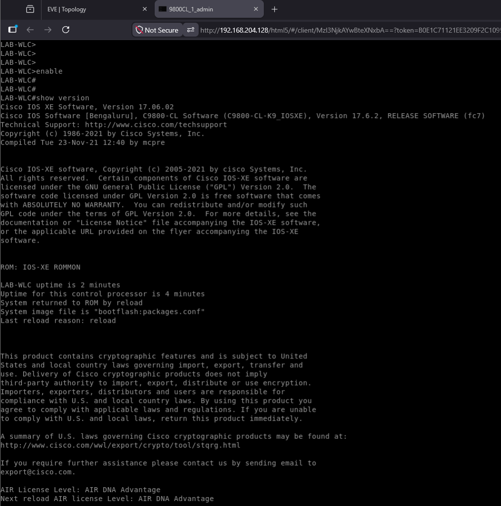
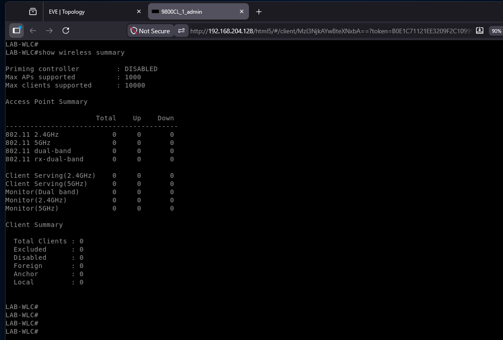
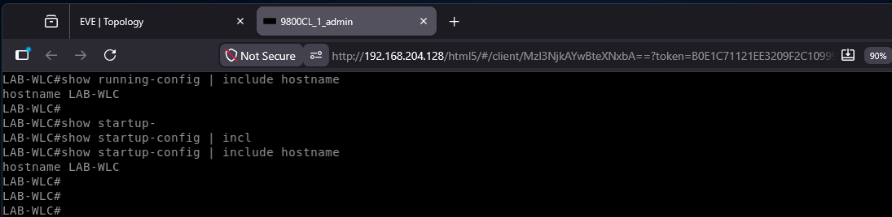
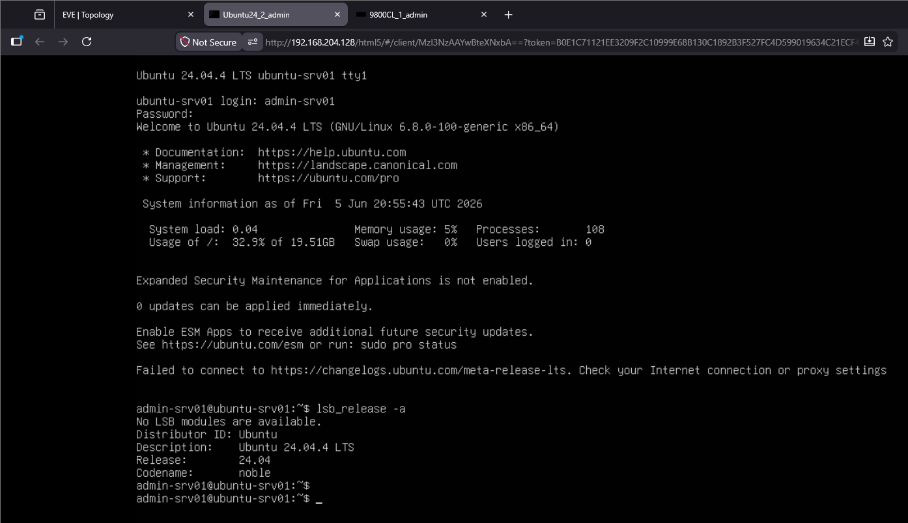
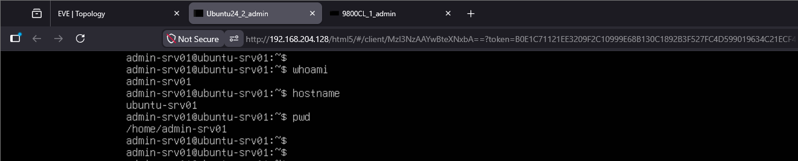

# Phase 01 – Foundation

## Objective

Establish the foundational infrastructure required to support future Netcore v2 development activities.

This phase focuses on platform validation, core image deployment and preparation of the initial Linux server environment.

---

## Environment

### Virtualisation Platform

| Component    | Value                    |
| ------------ | ------------------------ |
| Hypervisor   | VMware Workstation       |
| Lab Platform | EVE-NG Community Edition |

### Core Images

| Platform                | Purpose                       |
| ----------------------- | ----------------------------- |
| Cisco IOSv              | Routing                       |
| Cisco IOSvL2            | Switching                     |
| Cisco C9800-CL          | Wireless Controller           |
| Ubuntu Server 24.04 LTS | Linux Infrastructure Services |

---

## Cisco C9800-CL Validation

### Activities

* Imported Cisco C9800-CL image to introduce enterprise wireless infrastructure capability.
* Deployed controller within EVE-NG (Emulated Virtual Environment - Next Generation) to provide a virtual wireless management platform.
* Verified software version to establish a known operational baseline.
* Saved the controller configuration to ensure changes persist across reboots.
* Reloaded the controller to validate normal startup and recovery behaviour.
* Confirmed configuration persistence to verify reliable operation after restart.

### Result

The controller booted successfully and remained operational after reload.

Software Version: 17.6.2

### Notes

Controller stability improved after increasing resources to:

* 4 vCPU
* 8 GB RAM

---

## Ubuntu Server 24.04 Deployment

### Activities

* Downloaded Ubuntu Server 24.04.4 LTS (Long-Term Support) to provide a Linux infrastructure platform.
* Created QEMU (Quick Emulator) image directory to host the virtual machine assets.
* Created qcow2 (QEMU Copy-On-Write version 2) virtual disk to provide persistent storage for the server.
* Uploaded installation media to enable operating system deployment.
* Installed Ubuntu Server to establish the foundational Linux environment.
* Installed OpenSSH Server to enable secure remote administration
* Created administrative account to support system management activities.
* Verified successful login to confirm a functional server deployment.

### Result

Ubuntu Server deployed successfully and is accessible through the EVE-NG console.

---

## Current Status

### Completed

* EVE-NG operational
* Cisco IOSv available
* Cisco IOSvL2 available
* Cisco C9800-CL validated
* Ubuntu Server deployed
* OpenSSH installed

### Outstanding

* Connect Ubuntu Server to lab network
* Configure IP addressing
* Validate network connectivity
* Validate SSH connectivity

---

## Lessons Learned

### Cisco C9800-CL

The controller is sensitive to resource allocation and performs significantly better with 4 vCPU and 8 GB RAM.

### Ubuntu Deployment

Ubuntu Server can be successfully deployed within EVE-NG using a custom QEMU image and qcow2 virtual disk.

---

## Validation artefacts

### Figure 1 – Cisco C9800-CL Software Validation

The Cisco Catalyst 9800-CL Wireless LAN Controller was successfully deployed within EVE-NG and validated running Cisco IOS-XE 17.6.2. The controller retained its configuration following a system reload, confirming configuration persistence.

### Figure 2 – Cisco C9800-CL Wireless Summary

The wireless controller was successfully initialised and validated. At this stage no access points or wireless clients have been onboarded, establishing the baseline wireless state for future development activities.

### Figure 3 – Cisco C9800-CL Configuration Persistence

The controller hostname was verified in both the running and startup configurations, confirming that configuration changes were successfully saved and persist across system reloads.

### Figure 4 – Ubuntu Server Deployment Validation

Ubuntu Server 24.04.4 LTS was successfully deployed within EVE-NG. The operating system version, hostname and administrative account were verified following installation.

### Figure 5 – Ubuntu Server Initial Access Validation

Successful authentication was verified using the administrative account. User, hostname and working directory information confirmed that the server environment was operational and ready for further configuration.

